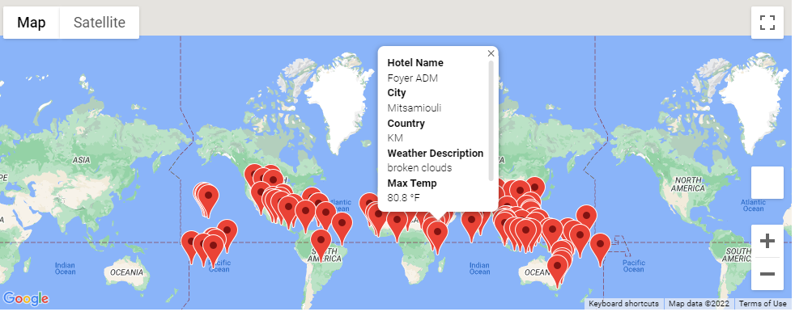
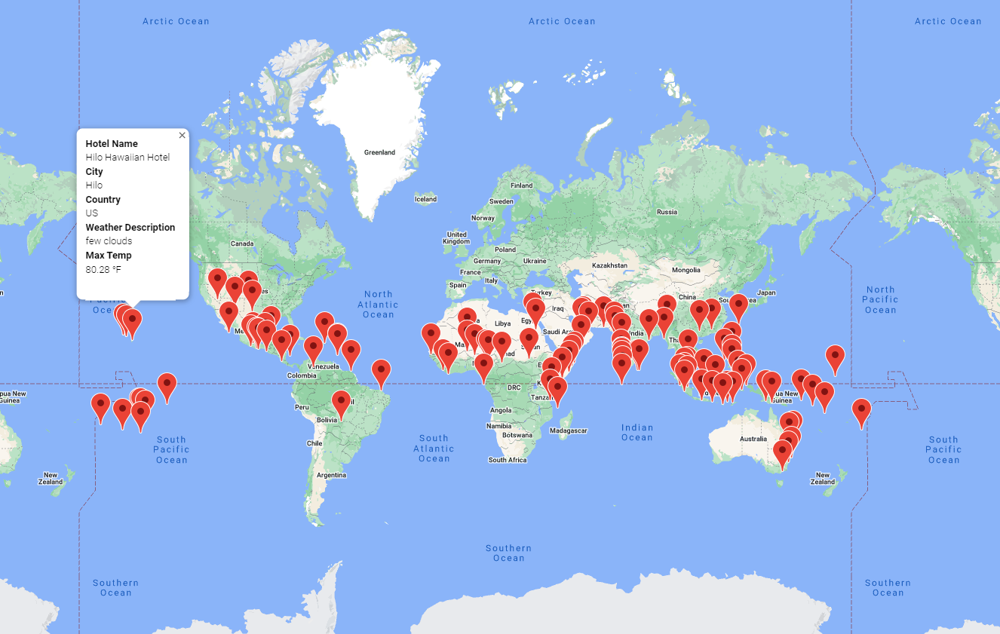
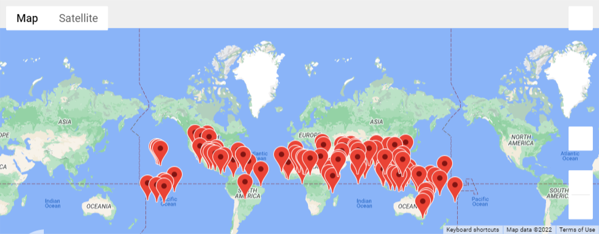
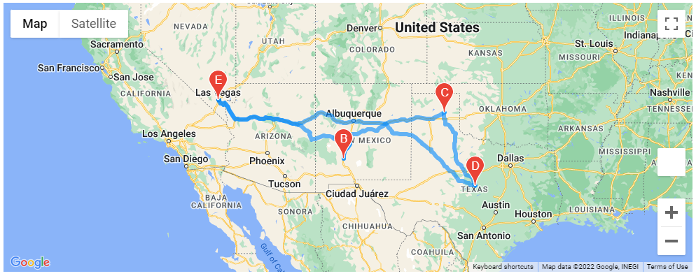
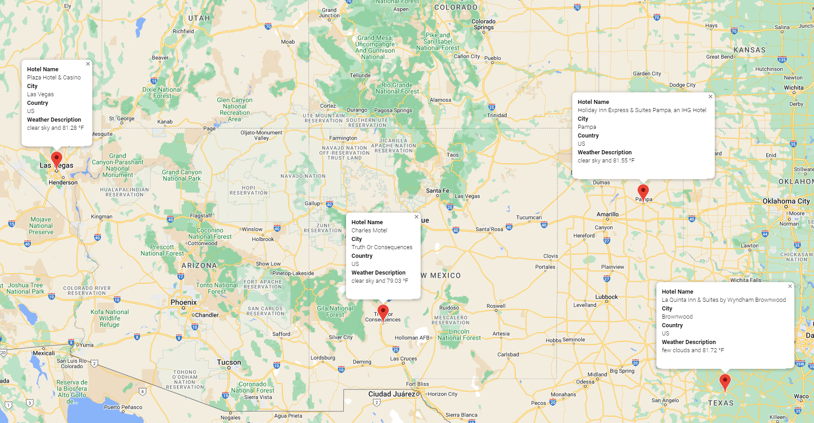

# World_Weather_Analysis
Jack loves the PlanMyTrip app. Beta testers love it too. And, as with any new product, they’ve recommended a few changes to take the app to the next level. Specifically, they recommend adding the weather description to the weather data retrieved in this module. Then, they'll have the beta testers use input statements to filter the data for their weather preferences, which will be used to identify potential travel destinations and nearby hotels. From the list of potential travel destinations, the beta tester will choose four cities to create a travel itinerary. Finally, using the Google Maps Directions API, you will create a travel route between the four cities as well as a marker layer map. The purpose of this Analysis is to create an easy way for Jack and his beta testers to create a new map to test. 

## Deliverable 1: Retrieve Weather Data
We generated a set of 2,000 random latitudes and longitudes, retrieved the nearest city, and performed an API call with the OpenWeatherMap. In addition to the city weather data we gathered in this module, we used our API skills to retrieve the current weather description for each city. Then, we created a new DataFrame containing the updated weather data.

Check out our files: Weather_Database.ipynb and our saved database in the file WeatherPy_Database.csv

## Deliverable 2: Create a Customer Travel Destinations Map
Here, we used input statements to retrieve customer weather preferences, then used those preferences to identify potential travel destinations and nearby hotels. We showed those destinations on a marker layer map with pop-up markers.

## Deliverable 3: Create a Travel Itinerary Map
In this deliverable, we used the Google Directions API to create a travel itinerary that shows the route between four cities chosen from the customer’s possible travel destinations. Then, we created a marker layer map with a pop-up marker for each city on the itinerary. Check out our work below!

